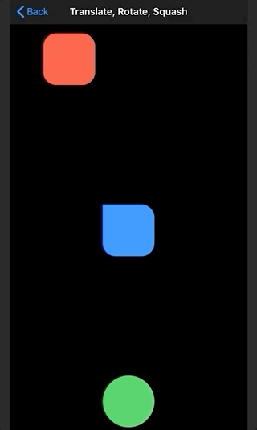
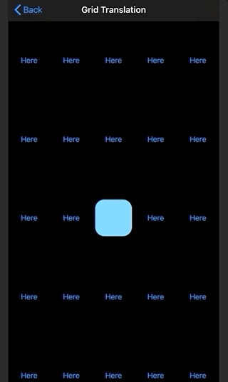
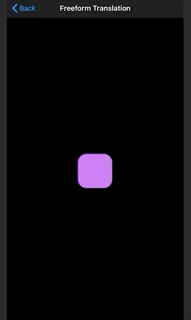
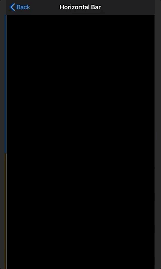
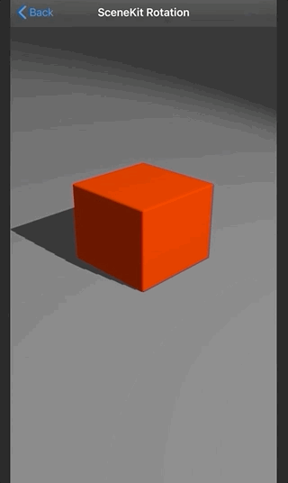
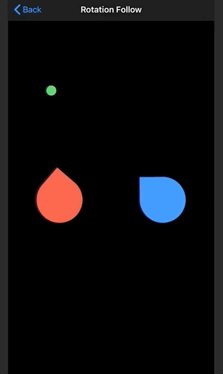
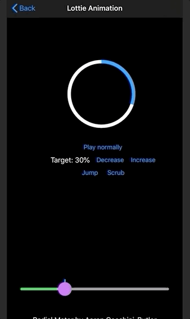

# Numeric Springing Examples
Example usage of the Numeric Springing framework, which can be found [here](https://github.com/LactoseGK/swift-numeric-springing).

## Setup
1. Clone this repository.
2. Open the project in Xcode.
3. Build and run the project.

## Examples
### Translate, Rotate & Squash

Tap the colored views.

* The red view at the top moves when tapped.
* The blue view in the middle rotates when tapped.
* The green view at the bottom squashes and unsquashes when tapped.

### Grid Translation

Tap the buttons.

The blue view will move to the tapped button.

### Freeform Translation

Touch anywhere on-screen.

The purple view will move to the tapped location.

### Vertical Bar

Tap anywhere on-screen.

The 2 colored views will expand in height to the tapped location. The blue view on the left animates, while the yellow view on the right snaps to the height directly.

### Horizontal Bar

Tap anywhere on-screen.

The 2 colored views will expand in width to the tapped location. The blue view on the top animates, while the yellow view on the bottom snaps to the width directly.

### SceneKit Rotation

Touch and drag.

The box will rotate when dragged, and animate back to its original rotation when the touch ends.

### Rotation Follow

Touch anywhere on-screen.

The 2 colored views will rotate to face the touch location (marked in green). The red view on the left animates, while the blue view on the right snaps directly.

### Lottie Animation

Press the `Play`button to make the animation play normally.

Press the `+` and `-` buttons to adjust the target progress.

Press the `Jump` button to make the animation move to the target progress, moving without animation.

Press the `Scrub` button to make the animation move to the target progress, moving with a spring animation.

Drag the slider to scrub through the animation with spring-based movement.

#### Lottie animation credits
[Radial meter, by Aaron Cecchini-Butler](https://lottiefiles.com/14941-radial-meter)
